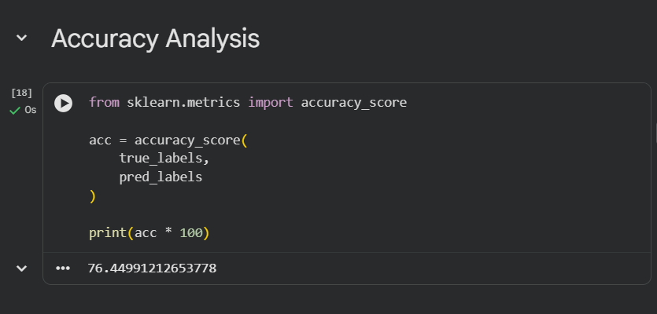

# Few-Shot Skin Disease Classification using Prototypical Networks

## Overview

Skin disease classification is a challenging task because many diseases have only a limited number of labeled training images. Conventional deep learning models generally require large datasets to achieve good performance, making them less suitable for rare disease classification.

This project presents a Few-Shot Learning approach that classifies skin diseases using only a small number of support images. A pretrained DenseNet121 model is used to extract feature embeddings, representative support samples are selected using K-Means clustering, and class prototypes are generated for classification. The prediction process is further supported with Grad-CAM visualization to improve model interpretability.

---

## Features

- Few-Shot Learning for skin disease classification
- DenseNet121 as a pretrained feature extractor
- Prototype-based classification
- K-Means support image selection
- Euclidean distance-based prediction
- Grad-CAM for model explainability
- False negative analysis
- Confusion matrix evaluation
- N-shot performance comparison

---

## Project Workflow

```
Dataset
    │
    ▼
Image Preprocessing
    │
    ▼
DenseNet121 Feature Extraction
    │
    ▼
Image Embedding Generation
    │
    ▼
K-Means Clustering
    │
    ▼
Support Image Selection
    │
    ▼
Prototype Generation
    │
    ▼
Distance-Based Classification
    │
    ▼
Prediction
    │
    ▼
Performance Evaluation
```

---

## Project Structure

```
few-shot-skin-disease-classification/
│
├── FewShot_SkinDisease_Classification.ipynb
├── README.md
├── requirements.txt
├── .gitignore
└── images/
```

---

## Technologies Used

- Python
- TensorFlow / Keras
- DenseNet121
- OpenCV
- NumPy
- Scikit-learn
- Matplotlib
- Pandas
- Google Colab

---

## Methodology

### Feature Extraction

DenseNet121 pretrained on ImageNet is used to generate high-dimensional feature embeddings from dermoscopic images.

### Support Image Selection

K-Means clustering selects representative support images by identifying samples closest to each cluster centroid.

### Prototype Generation

Embeddings of the selected support images are averaged to create a prototype representing each disease class.

### Classification

Each query image is converted into an embedding and classified by computing the Euclidean distance to every class prototype. The nearest prototype determines the predicted class.

### Explainability

Grad-CAM highlights the regions of the input image that contribute most to the model's prediction, improving transparency and interpretability.

### Performance Evaluation

The model is evaluated using overall accuracy, confusion matrix analysis, false negative analysis, and N-shot experiments.

---

## Results

The implementation demonstrates:

- Feature extraction using DenseNet121
- Prototype-based Few-Shot Learning
- K-Means support image selection
- Confusion matrix evaluation
- Embedding space visualization
- Grad-CAM visualization
- False negative analysis
- N-shot learning comparison

---

## Dataset

This project is based on the HAM10000 Skin Lesion Dataset.

The dataset is not included in this repository because of its size. After downloading the dataset, organize it using the following structure:

```
dataset/
│
├── df/
│   ├── support/
│   └── query/
│
├── vasc/
│   ├── support/
│   └── query/
│
└── akiec/
    ├── support/
    └── query/
```

---

### Confusion Matrix

The confusion matrix illustrates the classification performance of the proposed Few-Shot Learning model across all skin disease classes.

<p align="center">
  
</p>

---

### Accuracy

The proposed Few-Shot Learning model achieved an overall classification accuracy of **76.45%** on the query dataset.

<p align="center">
    
  <b>Overall Accuracy: 76.45%</b>
</p>
---

### Embedding Space Visualization

The embedding space generated by DenseNet121 is visualized using t-SNE after K-Means clustering. Images with similar visual characteristics are grouped closer together.

<p align="center">
  
</p>

---

### Grad-CAM Visualization

Grad-CAM highlights the discriminative regions that influenced the model's prediction, providing visual interpretability of the classification process.

<p align="center">
  
</p>

---

### Sample Predictions

Example predictions obtained using the prototype-based classifier.

| Disease | Prediction |
|---------|------------|
| Dermatofibroma (DF) |  |
| Vascular Lesion (VASC) |  |
| Actinic Keratosis (AKIEC) |  |

## Installation

Install the required Python packages using:

```bash
pip install -r requirements.txt
```

Open the notebook in Google Colab, update the dataset path, and execute the cells sequentially.

---

## Future Work

- Extend the framework to additional skin disease categories
- Improve prototype generation using attention mechanisms
- Evaluate Vision Transformer-based feature extractors
- Improve Grad-CAM visualization quality
- Develop a web-based prediction interface
- Optimize the model for real-time clinical applications

---

## Author

**Padmesh B**

